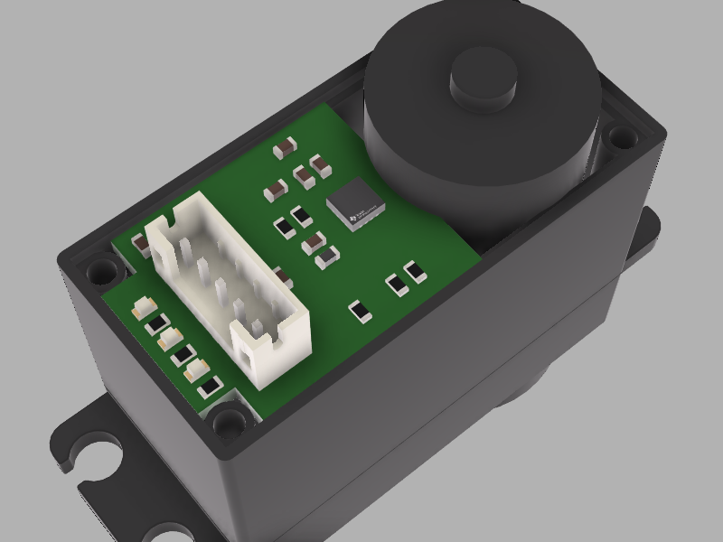
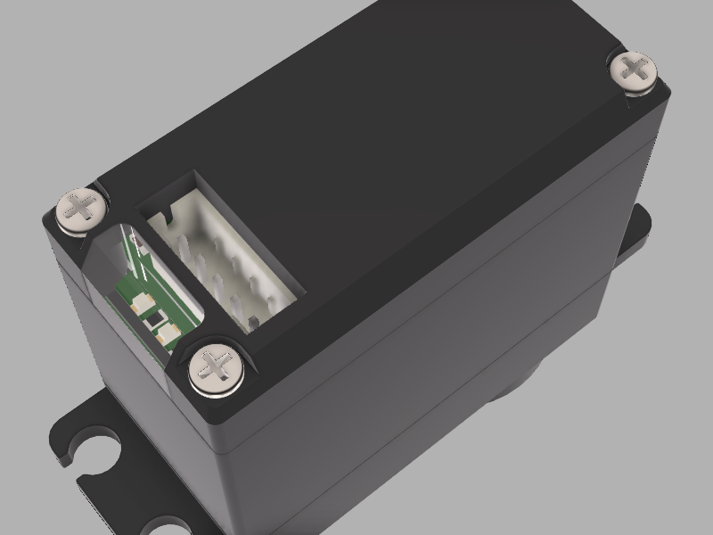
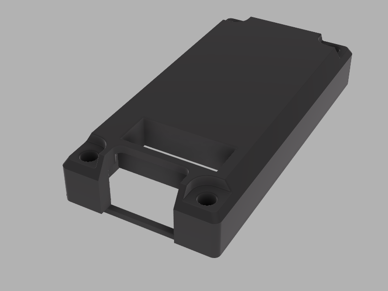
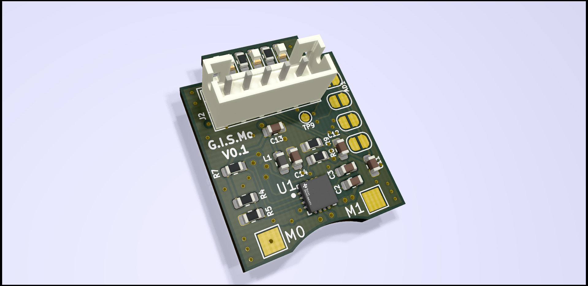
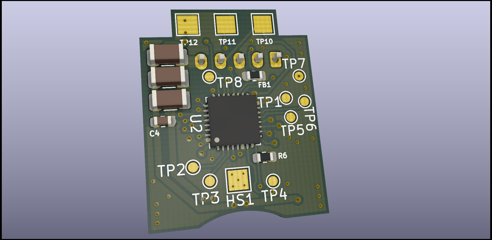
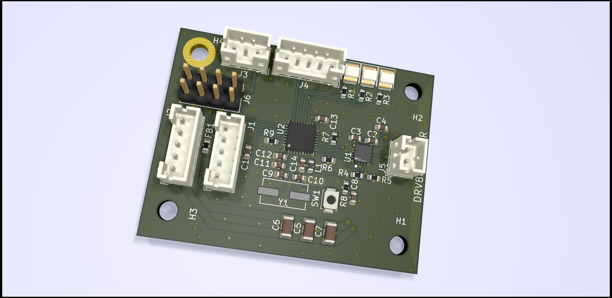

# G.I.S.Mo

  |   | 
:-------------------------:|:-------------------------:|:-------------------------:

After a long search, I have failed to find a servo motor that does everything I need for my projects that is also cheap(ish) and fully programmable (say no to closed source stuff whenever you can).

Well, thus was born the idea of GISMo (Greatly Inteligent Servo Motor). This project aims to develop a board that can be used to replace the vanilla servo driver boards that comes with cheaper ones such as MG995 and MG996R, giving it more power and making it more usefull for distributed controll projects:

Wishlist:
- [x] Embedded MCU (STM32F302 powered!) 
- [x] Current sensing (for torque controll and power management features) 
- [ ] I2C interface (or if you please, just change a bit the circuit to use whatever interface you want)
- [x] Programable LED's (because they are cool)
- [x] Absolute magnetic encoder (at least 12bits)
- [x] Free range of movement (180 degrees is just not enough)
- [ ] Control:
    - [ ] Simple position PID loop
    - [ ] MISO controller for speed and position simultaniously (Probably a state space controller)
    - [ ] Torque controll loop
    - [ ] Trapezoidal position curve following
- [ ] Configurable parameters
    - [ ] Speed/Position/Current limit
    - [ ] Controller mode
    - [ ] Configurable break zone (turn on break when position reaches its demand and settles)
    - [ ] Multiturn counter
    - [ ] Controller gains (PID and state space gain matrix)
- [ ] ROS2 Interface node:
    - [ ] Hot plug I2C device detection
    - [ ] Configuration via YAML and ROS Param
    - [ ] up to 16 Individually addressed servos

# Organization
The project contains 3 main blocks: first is the hardware, using [KiCad](https://kicad-pcb.org/), in the Hardware folder you will find 2 subfolders, one for the dev board, which is a big version of the board with some more stuff to facilitate firmware development and debugging, and a second one that contains the GISMo board that actually fits in the servo (to be made).
Then we have the Firmware with two other bits, the [CubeMX](https://www.st.com/en/development-tools/stm32cubemx.html) project so we have everything neatly initialized in our MCU, and the actual firmware and its libs.

# Version History
Now this is a bit tricky. I have 3 things to version and no interest in havving 3 different repos for them at all, so ill trake and make it sensible.

Each sub-thing will have its own sub-version, and once I have a combination of the 3 of them that kind of works, I will merge it into the master branch and tag it with a overall version of the repo (if that makes sense).

## Firmware
--

## GISMo Board
- [Interactive BOM](http://htmlpreview.github.io/?https://github.com/wandrade/GISMo/blob/develop/Hardware/GISMoBoard/bom/ibom.html)

 | 
:-------------------------:|:-------------------------:
- 0.0.1 - Copy of dev board with a few changes to reduce space usage
    - Only one I2C/Power plug
    - Replaced Address header pins by solder jumpers
    - Motor and PWM sensor connectors replaced with solder pads
    - Included a heat sink pad under the motor driver
    - Removed Crystal and oscilator
    - Reduced LED packages
    - Removed Debug connector
    - Removed reset button

## Development Board
- [Interactive BOM](http://htmlpreview.github.io/?https://github.com/wandrade/GISMo/blob/develop/Hardware/DevBoard/bom/ibom.html)

This board is meant for circuit testing and ease of debugging.

- 0.0.1 - Initial proposal board for development board schematic and layout.
    - [STM32F302K8 MCU](https://www.st.com/en/microcontrollers-microprocessors/stm32f302k8.html) - Small package and seemingly enough processing power for everything we need.
    - [DRV8876RGTR Driver](https://www.ti.com/store/ti/en/p/product/?p=DRV8876RGTR) - Has more than double the current needed and provides an inbuilt current sensing solution (hopefully good enough)

# Costs
Here I will keep track of how much you have to pay for each of the more expensive bits so you have an idea of how much a working GISMo will cost you.

# FAQ
I have barely started this project and everytime I tell somebody about it, I get the same questions, so here we go:

- Why not use a normal DC motor with drivers tailored for each project:
    - Cause I like modular! It saves time and you dont have to do everything multiple times. Plus, a lot of the stuf you find online if you are 3D printing, is already made for this size motor. Plus Plus, sorting out motor specifications, gearboxes, making gears (when necessary) is all just a pain, this one can do a lot of the stuff I need for anyway (robotic arms and legged robots).

- Why not just buy a smart servo? this one will probably cost almost the same as the comercial ones.
    - For one, i Hope to make it at least the same price as the "cheap" smart servos. But really, mainly, so I can have full power over its features and its firmware. Also cause its fun!

For now that is it, lets see what comes next :)

# License
Everything under this repository is free to use unless it is used to generate profit. The license states that it CAN be used for comercial puproses, however an agreement have to be reached between the original creator of this project (Werner Thomassen Andrade) and the interested parties before that can happens.
